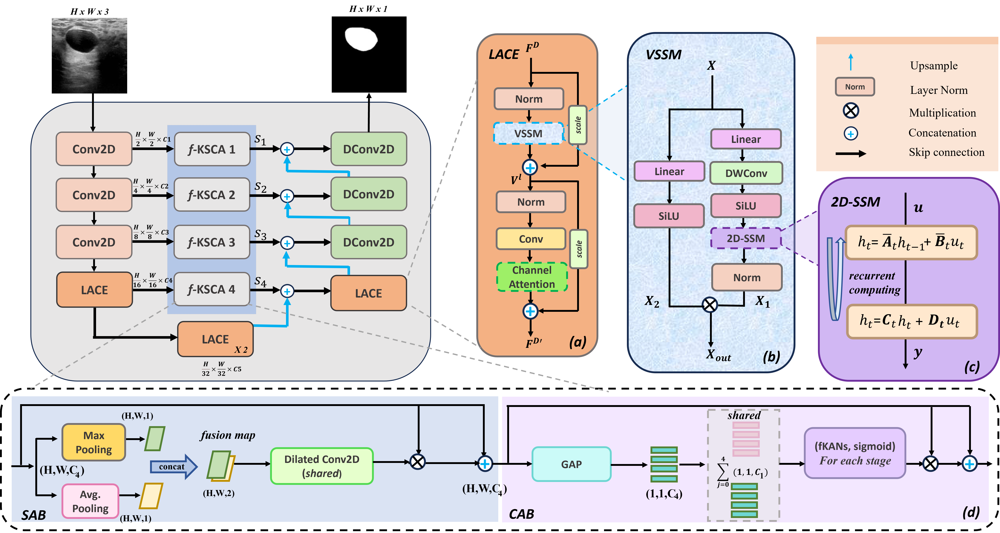

# MedKamba[MIDL'26]


**MedKamba: Medical Image Segmentation using KAN and Mamba**

MedKamba is a PyTorch implementation of a hybrid segmentation architecture (`UKAN`) that combines **Kolmogorov–Arnold Networks (KAN)** with **Mamba (state-space model)** blocks inside a U-Net-style encoder-decoder for medical image segmentation.

## Overview

The core model, `UKAN` (defined in `archs.py`), replaces standard MLP/attention bottleneck blocks with:
- **KAN layers** (`kan.py`) using learnable spline-based activations, driven by a Fractional Jacobi Neural Block activation (`jacobi_polynomial.py`).
- **Mamba-based token-mixing blocks** (`mambair_archs.py`, `BasicLayer`) for efficient long-range spatial modeling.
- A convolutional encoder/decoder stem with a channel-and-spatial attention bridge (`KAN_SCA`) between skip connections.

## Architecture



The network follows an encoder–decoder design (b) with a **LACE** (Local-Aware Channel Enhancement) block and **f-KSCA** (fractional-KAN skip/channel attention) modules at each skip-connection stage, fused back into the decoder via `DConv2D` blocks.

- **(a) LACE**: normalizes the input feature map, passes it through a **VSSM** block with a learnable scale, adds a residual, then applies a second norm → conv → channel-attention branch before a final residual sum, producing the refined feature map `F^D'`.
- **(b) VSSM (Visual State-Space Module)**: splits the input into two paths — a linear→DWConv→SiLU path and a linear→SiLU path — feeding a **2D-SSM** block, then recombines the two branches by multiplication and normalization to produce `X_out`.
- **(c) 2D-SSM**: the core state-space recurrence, `h_t = Ā_t h_{t-1} + B̄_t u_t` followed by the output equation `h_t = C_t h_t + D_t u_t`, computed recurrently over the spatial/token sequence.
- **(d) SAB / CAB**: the spatial attention branch (SAB) fuses max- and average-pooled feature maps via a shared dilated Conv2D to produce a spatial attention map; the channel attention branch (CAB) applies global average pooling followed by shared fractional-KAN (fKAN) layers with a sigmoid gate, per stage, to produce channel attention weights. Both are combined with the input feature map via multiplication and residual addition.

The encoder stacks `Conv2D` and `LACE` stages (downsampling by 2 at each stage, down to `H/32 × W/32`), the bottleneck applies `LACE` twice, and the decoder mirrors this with `f-KSCA` + `DConv2D` stages, fusing skip connections `S1`–`S4` back in at matching resolutions.

## Repository Structure

| File | Description |
|---|---|
| `archs.py` | Model definitions, including the main `UKAN` architecture, `KANLayer`, `KANBlock`, and attention bridge modules. |
| `kan.py` | KAN linear layer implementation (`KANLinear`, `KAN`). |
| `jacobi_polynomial.py` | Jacobi polynomial basis functions used by the fractional KAN activation. |
| `mambair_archs.py` | Mamba-based `BasicLayer` token-mixing blocks used in the bottleneck. |
| `dataset.py` | `Dataset` class for loading image/mask pairs from disk. |
| `losses.py` | `BCEDiceLoss` and `LovaszHingeLoss` loss functions. |
| `metrics.py` | IoU, Dice, and other segmentation evaluation metrics. |
| `train.py` | Training script/entry point. |
| `val.py` | Validation/inference script. |
| `config.py` | Yacs-based config scaffold (Swin-style), used for auxiliary configuration. |
| `requirements.txt` | Python dependencies. |

## Installation

```bash
git clone https://github.com/akankshay-cyber/MedKamba_MIDL.git
cd MedKamba_MIDL

# create environment (recommended)
conda create -n medkamba python=3.8 -y
conda activate medkamba

pip install -r requirements.txt

# install PyTorch with the CUDA build matching your system (example: CUDA 11.6)
pip install torch==1.13.0+cu116 torchvision==0.14.0+cu116 torchaudio==0.13.0 --extra-index-url https://download.pytorch.org/whl/cu116
```

> **Note:** `archs.py` and `kan.py` import from local modules `utils` and `fkan` (e.g. `from utils import *`, `from fkan import FractionalJacobiNeuralBlock`) that are not currently present in this repository. Add `utils.py` (providing `AverageMeter`, `str2bool`, etc.) and `fkan.py` (providing `FractionalJacobiNeuralBlock`) before running training/validation.

## Dataset Format

Datasets should be organized as follows:

```
<dataset name>
├── images
│   ├── 0a7e06.jpg
│   ├── 0aab0a.jpg
│   └── ...
└── masks
    ├── 0
    │   ├── 0a7e06.png
    │   ├── 0aab0a.png
    │   └── ...
    ├── 1
    │   └── ...
    └── ...
```

Each class has its own subfolder under `masks/`, with one grayscale mask per image, matching the `<img_id>` naming used in `images/`.

## Training

```bash
python train.py \
    --arch UKAN \
    --dataset <dataset_name> \
    --data_dir inputs \
    --output_dir outputs \
    --input_w 256 --input_h 256 \
    --epochs 400 \
    -b 8 \
    --loss BCEDiceLoss \
    --optimizer Adam \
    --lr 1e-4 \
    --kan_lr 1e-2
```

Key arguments (see `train.py` for the full list):

| Argument | Default | Description |
|---|---|---|
| `--arch` | `UKAN` | Model architecture name (from `archs.py`). |
| `--dataset` | `busi` | Dataset name. |
| `--data_dir` | `inputs` | Root directory containing the dataset. |
| `--output_dir` | `outputs_busi_MIDL_seed44` | Directory where checkpoints/logs are saved. |
| `--input_w`, `--input_h` | `256`, `256` | Input image size. |
| `--epochs` | `400` | Number of training epochs. |
| `-b`, `--batch_size` | `8` | Mini-batch size. |
| `--loss` | `BCEDiceLoss` | Loss function (`BCEDiceLoss`, `LovaszHingeLoss`, `BCEWithLogitsLoss`). |
| `--optimizer` | `Adam` | Optimizer (`Adam`, `SGD`). |
| `--lr` | `1e-4` | Learning rate for non-KAN parameters. |
| `--kan_lr` | `1e-2` | Learning rate for KAN parameters. |
| `--scheduler` | `CosineAnnealingLR` | LR scheduler (`CosineAnnealingLR`, `ReduceLROnPlateau`, `MultiStepLR`, `ConstantLR`). |
| `--no_kan` | `False` | Disable KAN layers (use plain MLP instead). |
| `--deep_supervision` | `False` | Enable deep supervision. |
| `--resume` | `None` | Path to a checkpoint to resume from. |

## Validation

```bash
python val.py --name <run_name> --output_dir outputs
```

This loads the config saved during training (`<output_dir>/<run_name>/config.yml`) and evaluates the corresponding checkpoint on the validation/test split, reporting IoU, Dice, and related metrics (`metrics.py`).

## Metrics

`metrics.py` computes:
- **IoU** and **Dice coefficient** (`iou_score`)
- Extended indicators: IoU, Dice, recall, HD95, Hausdorff distance, specificity, precision (`indicators`)

## Requirements

See `requirements.txt`. Core dependencies include PyTorch, `timm`, `albumentations`, `opencv-python`, `scikit-image`, `scipy`, `pandas`, `tensorboardX`, and `yacs`/`pyyaml`.

## Citation

If you use this code in your research, please cite the corresponding MIDL submission (citation details to be added).

## License

No license file is currently included in this repository. Add a `LICENSE` file to specify usage terms.
